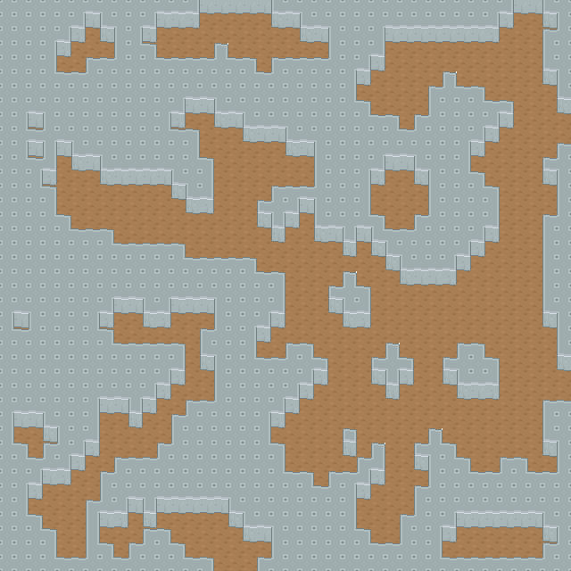
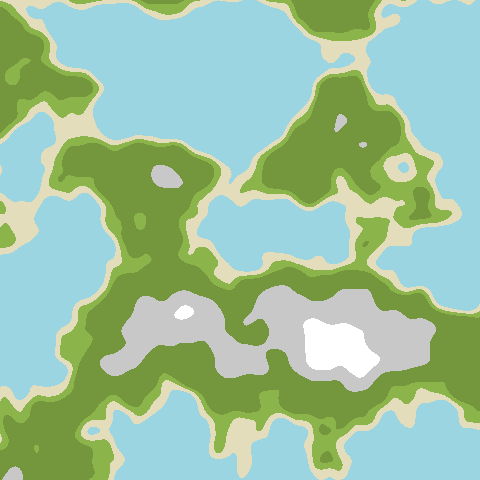
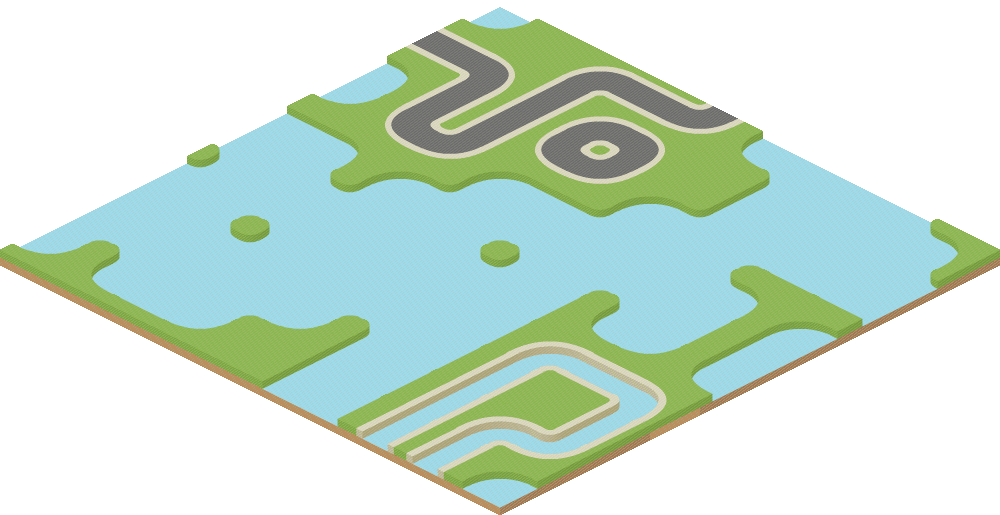

# World-Building in Haskell

An introduction to a couple techniques in procedural generation, written in a
language that arguably couldn't be less-suited to the task.

All the visual assets come from the incredible [kenney.nl](https://kenney.nl/)
resources - thoroughly recommend checking them out if, like me, you would love
to play with procedural world generation, but have no artistic ability.

If you're looking to understand this code, the best place to start is probably
`app/Main.hs`. This should give you an idea of what the different parts of
`src` are doing through some examples.

